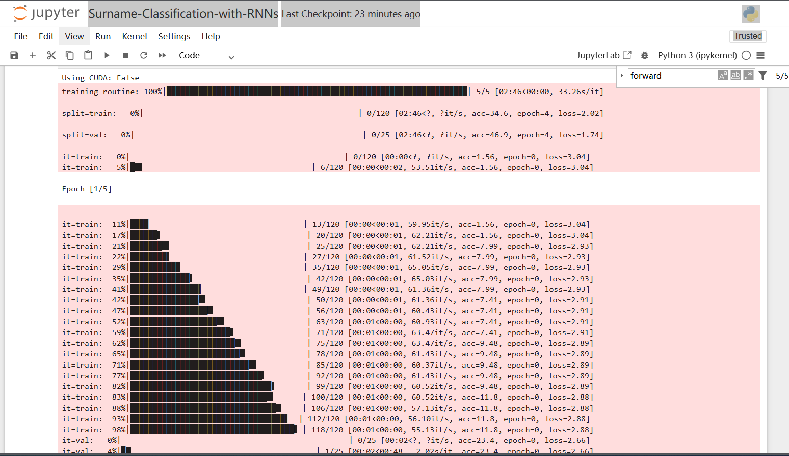

# 训练


# 模型结构验证


# 无条件姓氏生成
`Model1_Unconditioned_Surname_Generation.py`


# 有条件姓氏生成
`Model2_Conditioned_Surname_Generation.py`


### ① 两个模型的核心差异体现在什么机制上？
A. 字符编码方式不同

B. 是否考虑国家信息作为生成条件

C. RNN单元类型不同（GRU/LSTM）

D. 损失函数计算方式不同
**正确答案**: `B. 是否考虑国家信息作为生成条件`

### ② 在条件生成模型中，国家信息如何影响生成过程？
A. 作为额外的输入特征拼接

B. 作为GRU的初始隐藏状态

C. 作为注意力机制的key

D. 作为输出层的偏置项

**正确答案**: `B. 作为GRU的初始隐藏状态`

### ③ `nation_emb`层的主要作用是什么？
```python
self.nation_emb = nn.Embedding(num_nationalities, rnn_hidden_size)
```

A. 将字符索引映射为稠密向量

B. 将国家标签转换为隐藏状态初始化向量

C. 生成姓氏的长度控制参数

D. 计算交叉熵损失的辅助参数
**正确答案**: `B. 将国家标签转换为隐藏状态初始化向量`  

### ④ 对比两个文件的sample_from_model函数，文件2新增了哪个关键参数？

A. temperature

B. nationalities

C. device

D. max_length

**正确答案**: `B. nationalities`  
